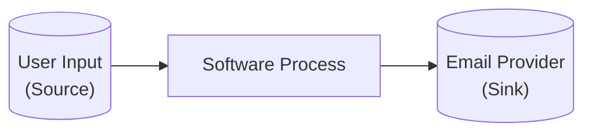
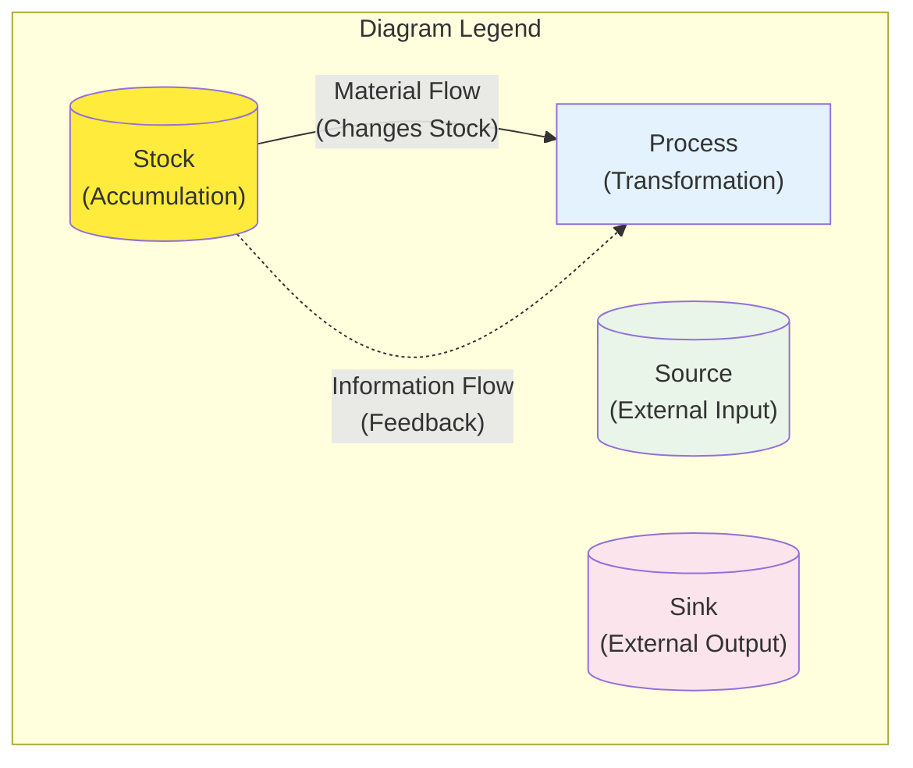
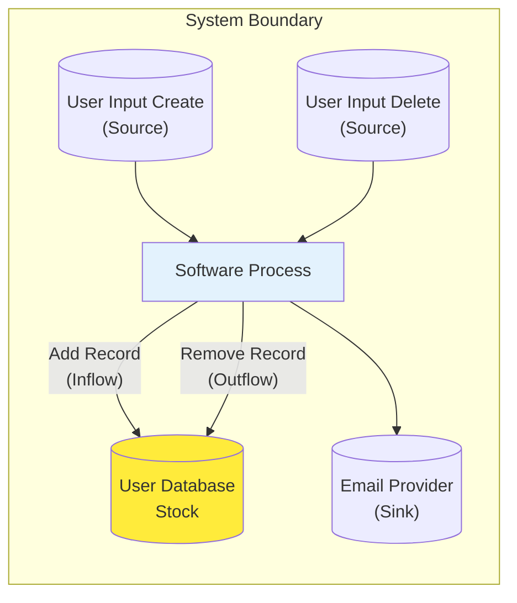
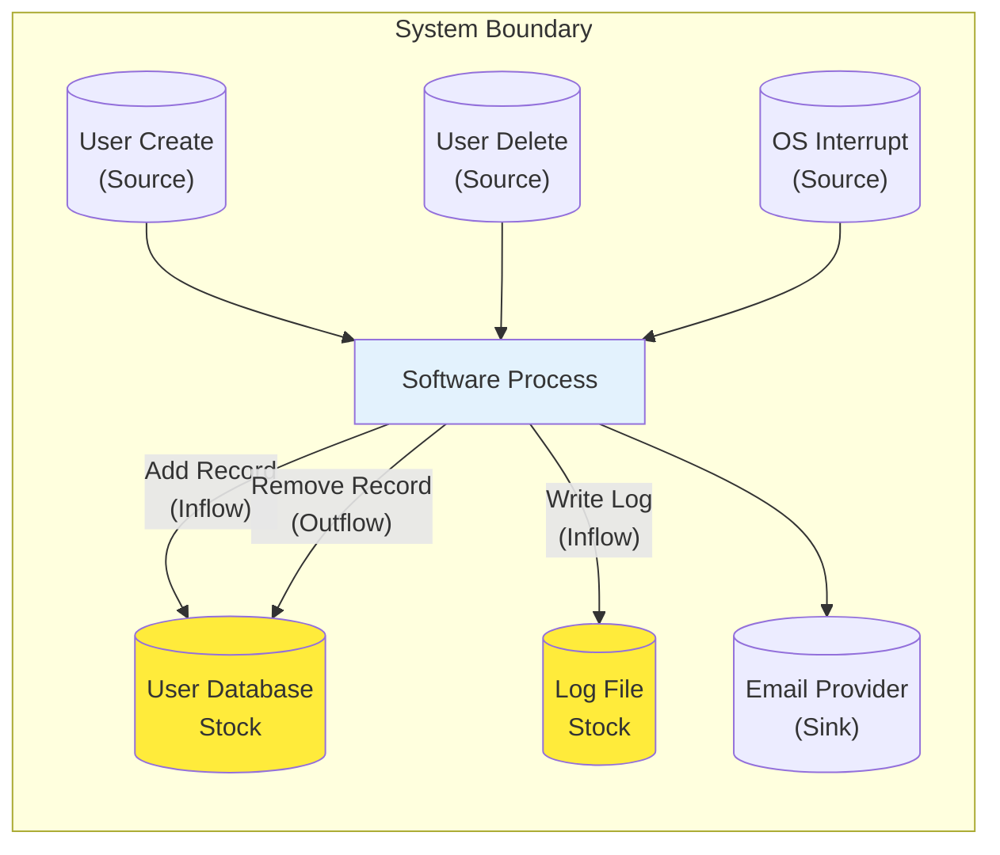
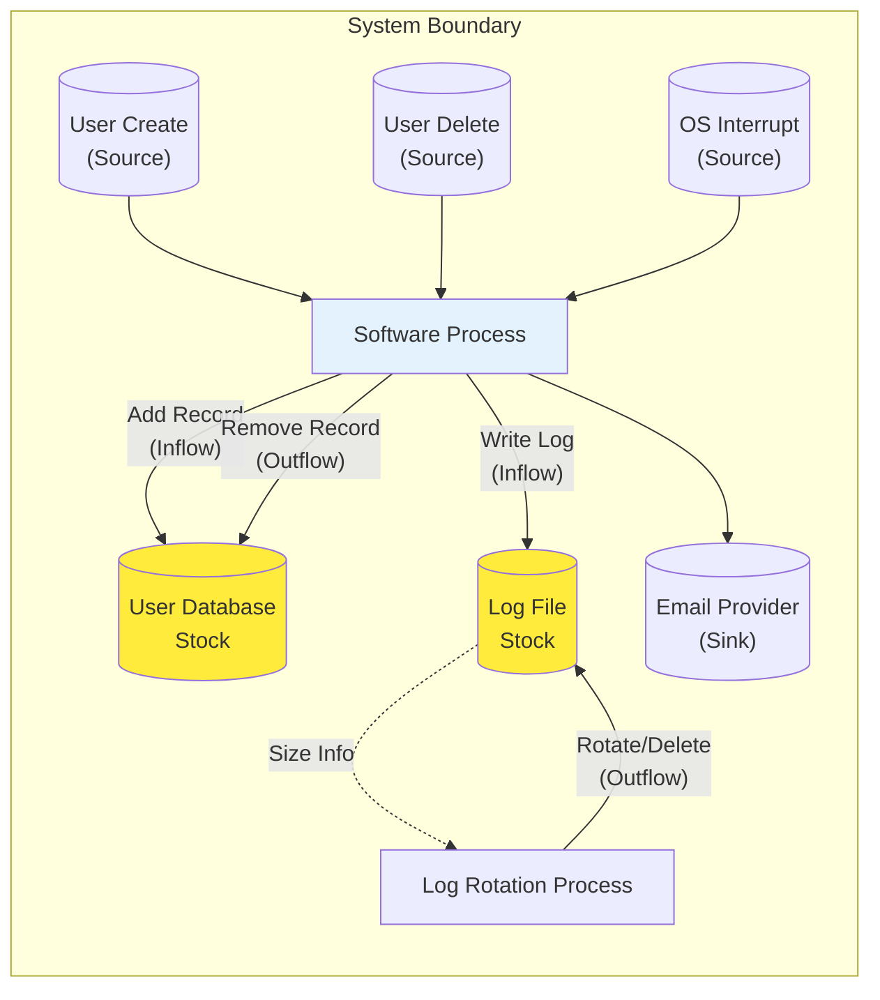
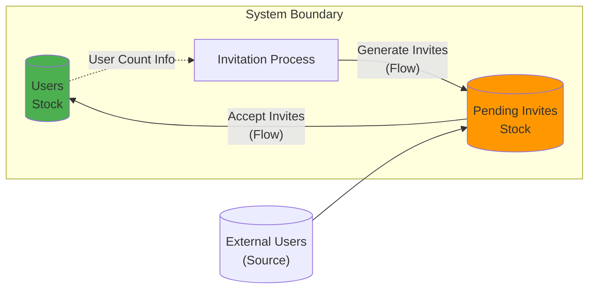
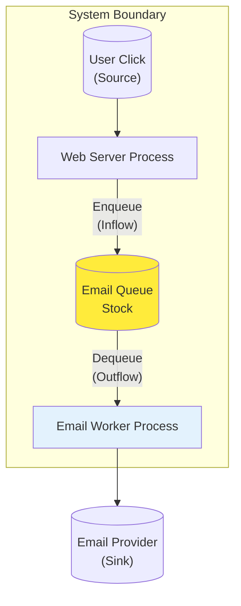
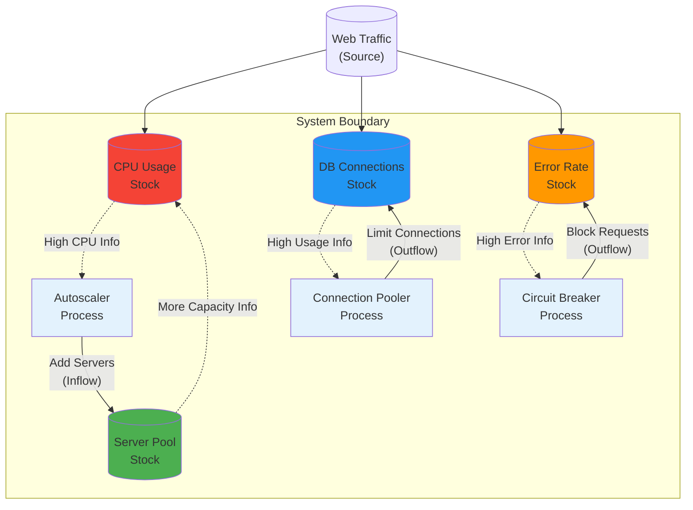

# Systems Thinking for Software Developers

### Using Systems Thinking to Identify Stocks, Flows, Feedback and Blast Radius

### Introduction: Software as Living Systems

In 1958, mathematician John Wilder Tukey used the term _software_ in print, distinguishing written instructions from physical hardware (Tukey, _American Mathematical Monthly_, Jan. 1958). Whether he coined the term or simply popularized it is still debated, but the shift it represented is undisputed.

In the decades since, software has expanded far beyond that definition. Today it is a complex web of languages, frameworks, processes, and increasingly, machine intelligence. It is no longer just a technical artifact; it's an evolving socio-technical ecosystem where people and technology constantly shape each other.

Many have tried to narrate and explain the process of building software. This post takes a different lens: systems thinking. I want to show how software, at its core, behaves like a living system and how understanding it through a systems thinking lens can help us see both technical and human complexity more clearly.

I lean here on foundational systems thinking work: Donella Meadows' _Thinking in Systems_ (2008) for the language of stocks, flows, and feedback. My goal isn't to re-teach their work, I am adapting it into the concepts of software.

### The Systems Thinking Vocabulary

Here are the key systems thinking terms that I am using in this post.

| **Term**                      | **Description**                                                                                                                                                                                                                             |
| ----------------------------- | ------------------------------------------------------------------------------------------------------------------------------------------------------------------------------------------------------------------------------------------- |
| **Stock**                     | An accumulation of something that represents the memory or state of a system; it changes only via flows.                                                                                                                                    |
| **Flow**                      | The rate of change that increases or decreases a stock over time; only flows change stocks.                                                                                                                                                 |
| **Inflow**                    | A flow that increases a stock.                                                                                                                                                                                                              |
| **Outflow**                   | A flow that decreases a stock.                                                                                                                                                                                                              |
| **Source**                    | A point outside the system boundary from which a flow originates.                                                                                                                                                                           |
| **Sink**                      | A point outside the system boundary where a flow terminates.                                                                                                                                                                                |
| **Transient Flow**            | An action that occurs and completes without changing stocks within your system boundary (e.g., send email to external provider). **In reality, software always leaves traces, but these effects occur outside the system we're analyzing.** |
| **Process**                   | The mechanism that transforms inputs and influences flows acting on stocks.                                                                                                                                                                 |
| **Feedback Loop**             | A structure where outputs feed back as inputs, influencing future actions (reinforcing or balancing).                                                                                                                                       |
| **Balancing Feedback Loop**   | A goal-seeking loop that counteracts deviation to stabilize a stock near a target.                                                                                                                                                          |
| **Reinforcing Feedback Loop** | A loop that amplifies change, producing exponential growth or decay.                                                                                                                                                                        |
| **Delay**                     | The time it takes for information in a feedback loop to be processed and acted upon. Delays can destabilize systems.                                                                                                                        |

### From Bathtubs to a Systems Perspective

Let's start with a classic Systems Thinking example: a bathtub. The water in the tub is the **stock**. The faucet creates an **inflow**. You, watching the water level and adjusting the faucet, are a **feedback loop**. The float in a toilet tank that automatically shuts off the water is a **balancing feedback loop**, maintaining a stable water level. You, feeling relaxed listening to the sound of water and increasing the flow, would create a **reinforcing feedback loop**. The drain creates an **outflow**.

Now, let's apply this same thinking to software. At its simplest, software takes an input, processes it, and produces an output. Let's make this specific: software that accepts a user input and sends an email. This "Send Email" action is a **transient flow** - it happens once, leaves your system boundary, and creates no memory within your system.

**A Note on Diagram Conventions**: The diagrams in this post follow standard systems thinking notation. Here's what the symbols mean:

- **Cylinders** represent **stocks** - places where things accumulate (data, requests, resources)
- **Rectangles** represent **processes** - activities that transform inputs or control flows
- **Solid arrows** show **material flows** - actual movement that changes stock levels
- **Dotted arrows** show **information flows** - feedback that influences decisions but doesn't directly change stocks
- **Sources and sinks** (shown outside the system boundary) represent external inputs and outputs

The key insight is separating what flows (materials, data, work) from what informs (measurements, signals, feedback). A database getting new records is a material flow. A monitoring system reading CPU usage to decide whether to scale is an information flow.

### Adding Memory: Your First Stock

Next, let's add memory. A database is the perfect tool for the job. Our software uses a database to save user data. This action creates an **inflow** that increases the number of user records in the database. This is our system's first **stock** - an accumulation of memory.

Let's give the user an option to delete their data, which is an **outflow**. This triggers a flow that removes a record from our database stock.

### Environmental Context

Software never runs in a vacuum. The environment - hardware, operating systems, networks - introduces its own triggers, like interrupts or errors. Let's consider that our software just logs the interrupts. This introduces a second stock: a **log file**. An OS interrupt triggers an inflow that writes to this log, increasing its size.

### The First Feedback Loop: Self-Regulation

Whenever a new stock appears in a system, I immediately start looking for the feedback loop. **Who or what will react to the level of this stock**?

In this case, the log file is limited by disk space. If it grows too large, it can crash the application. To prevent this, the software must regulate itself using a **balancing feedback loop**. It monitors the log size and, upon reaching a threshold, triggers a rotation - an **outflow** that reduces the stock. 

What began as a simple system for managing user data has now evolved. The software's primary function, handling user input, inadvertently created a secondary requirement: a self-regulating system to manage the logs generated by its own operation.

This is where things get complicated. Logs are for the humans in the system. When rotation fails or lags, the application may keep running, but the cost shows up in human effort. The **delay** between when a log fills up and when it's rotated can lead to slow searches, delayed alerts, and missing context during an incident.

Once I find a feedback loop, the next question I ask is: **where are the delays, and what is their impact?** A delay in the log rotation loop pushes the cost onto humans first.

### A Quick Look at Reinforcing Loops

While our examples so far have been about stabilization, systems can also have loops that amplify change. Imagine we add a feature where each new user can invite three friends. This creates a **reinforcing feedback loop**. The more users we have, the more new users are invited, leading to exponential growth in our "Users" stock. This is a virtuous cycle, but reinforcing loops can also be vicious. Think of a server under high load that starts failing requests, which causes clients to retry, which increases the load even more, leading to a complete crash.

### Evolution Under Pressure: Adding Queues

Now, let's watch our system evolve under pressure. Traffic is spiking, and while the database holds up, sending emails synchronously is too slow. Users are noticing failures. A common solution is to add a queue, a choice that introduces a new stock and a different class of feedback.

What was once a simple transient flow now becomes a system with a new stock to manage:

This new stock forces us to ask new questions about potential feedback loops. What happens when there's a delay? The queue will back up. Do we need autoscaling to handle it? What's our plan if the email provider is slow or the network fails?

This leads to a crucial fourth question - **what's the blast radius?** Please note that this is not a traditional systems thinking term. **Blast radius** refers to the *scope and extent of impact when a system component fails, changes, or is compromised - encompassing all users, processes, systems, and business functions that would be directly or indirectly affected*. This question forces us to map the scope of impact and see the connected systems and human lives that depend on our decisions.

> **Note** - I spend considerable time on this question because making the invisible humans visible is one of the toughest challenges in system design. It's easy to see the technical components - databases, queues, servers - but the humans affected by our technical decisions often remain hidden until something goes wrong.

### Putting Systems Thinking into Practice

You can ask yourself, pair or team these four questions whenever you design, change, or troubleshoot your system:

1. **What are the stocks?** Identify every place where information or work accumulates.
2. **How are they regulated?** Find the feedback loops - both automated and human - that watch these stocks and try to keep them in balance.
3. **Where are the delays?** Pinpoint where the information in those feedback loops could be slow to arrive or act upon. That's where you'll find your most important work.
4. **What's the blast radius?** Map the scope of impact when this system fails or changes - which users, teams, processes, and downstream systems will be affected.

### A Practical Example: Spike in Web Traffic

This system is a web application that's suddenly getting more traffic than expected. It accepts HTTP requests, has a database, and manages user session data.

**Question 1: What are the stocks?**
- HTTP request queue (connection pool)
- Database connections pool
- Memory usage (heap, cache)
- CPU utilization
- Disk space (logs, temp files, database)
- User session data

**Question 2: How are they regulated?**
- Load balancer distributes requests (balancing loop)
- Connection pool limits concurrent database access (balancing loop)
- Garbage collector manages memory (balancing loop)
- Log rotation prevents disk overflow (balancing loop)
- Auto-scaling adds servers when CPU is high (balancing loop)
- Circuit breakers trip when error rates spike (balancing loop)

**Question 3: Where are the delays?**
- Auto-scaling taking time to provision new instances
- Database connection recovery after a failure takes a few seconds
- Cache warming after deployment takes several minutes
- Log analysis during an incident requires manual searching
- Memory leaks accumulate slowly, then crash suddenly

**Question 4: What's the blast radius?**
- Users can't reset passwords or receive account confirmations (direct user impact)
- Support team overwhelmed with "missing email" tickets (operational team impact)
- Marketing campaigns fail silently, skewing conversion metrics (business process impact)
- Security alerts don't reach on-call engineers (critical system impact)

### Conclusion: The Technical Foundation

These questions and their answers help uncover the stocks, flows, feedback loops, and delays in your system's technical architecture. You can start asking them during the design phase. I find this perspective creates a better catalyst for discussions - we tend to get stuck on implementation details and miss the bigger dynamics at play.

It's also effective for making architectural trade-offs explicit. When you bring a systems perspective to the table, the conversation changes. It forces different questions and moves the team from low-level concerns to the larger forces shaping system behaviour.

While this post tries to show the technical interplay in systems, a stronger system - humans - are embedded throughout as designers, operators, and decision-makers. They have their own stocks (knowledge, capacity, trust), flows (learning, communication, burnout), and feedback loops (code reviews, incident responses, performance evaluations).

The human systems often have longer delays, more complex dynamics, and ultimately determine whether our technical designs succeed or fail in practice. A perfectly designed auto-scaling system is useless if the team doesn't understand how to configure it, or if the organizational culture punishes the temporary slowdowns that come with scaling events.

**My recommendation for now**: Start with the next feature you're building or the current problem you're debugging. Draw a simple diagram of the technical system. Ask the four questions. Identify new or changing stocks. Look for the feedback loops. Identify the delays. Map the blast radius. See if it gives you a new perspective on the technical challenges.

But as you do this, pay attention to the human decisions, delays, and feedback loops you encounter. Notice where knowledge gets stuck, where communication breaks down, where good technical designs meet organizational reality. Those observations will be crucial for the next layer of systems thinking we'll explore.
